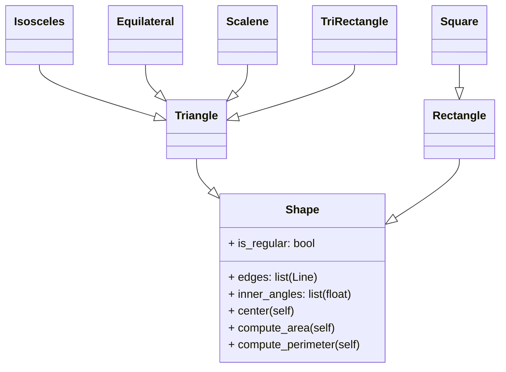

# POO-Reto_5
Reto 5, programando las clases de `Shape` en formato archivo unico y por módulos y paquetes

```mermaid
classDiagram
    class Shape {
        + edges: list(Line)
        + inner_angles: list(float)
        + is_regular: bool
        + center(self)
        + compute_area(self)
        + compute_perimeter(self)
    }

    class Triangle {
    }

    class Isosceles{
    }

    class Equilateral{
    }

    class Scalene{
    }

    class TriRectangle{
    }

    class Rectangle{
    }

    class Square{
    }

    Triangle --|> Shape
    Isosceles --|> Triangle
    Equilateral --|> Triangle
    Scalene --|> Triangle
    TriRectangle --|> Triangle
    Rectangle --|> Shape
    Square --|> Rectangle
```
